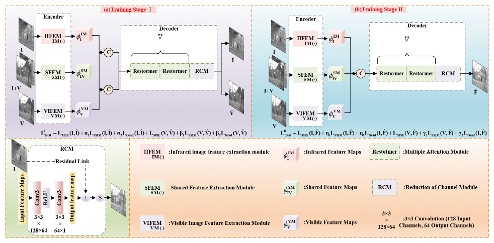

# TSTBFuse
TSTBFuse:A Two-Stage Three-Branch Feature Extraction Method for Infrared and Visible Image Fusion
-[*[Paper]*](https://www.aimspress.com/aimspress-data/era/2025/6/PDF/era-33-06-180.pdf)  

## Citation

```
@article{zhang2025TSTBFuse,
  title={TSTBFuse: a two-stage three-branch feature extraction method for infrared and visible image fusion},
  author={Wangwei Zhang, Xinyue Qin, Menghao Dai, Bin Zhou, Changhai Wang, ZhiHeng Wang,SongZe Li},
  journal={Electronic Research Archive},
  volume={33},
  number={6},
  year={2025},
  doi={10.3934/era.2025180}
}
```
## Abstract

The purpose of image fusion is to combine information from different source images to produce a comprehensively representative image. Traditional autoencoder architectures often struggle to effectively extract both unique and shared features from these image types. A novel two-stage three-branch feature extraction method (TSTBFuse) was proposed in the study, specialized for the fusion of infrared and visible images. The proposed architecture employed a three-branch encoder that separately captured infrared-specific thermal radiation features, visible-specific texture details, and shared structural information. A two-stage end-to-end training strategy was introduced: the first stage focused on reconstructing the original input images to preserve modality-specific information, while the second stage leveraged the learned representations to generate high-quality fused images. we designed a comprehensive loss function combining mean squared error (MSE), structural similarity index (SSIM), and gradient loss, ensuring both pixel-level accuracy and structural integrity. Extensive experiments on public datasets (TNO, MSRS and RoadScene) demonstrated that TSTBFuse consistently outperformed seven state-of-the-art methods in both subjective and objective evaluations. Furthermore, the method exhibited strong generalization capabilities, successfully extending to challenging tasks such as magnetic resonance imaging-computed tomography (MRI-CT) medical image fusion and red-green-blue (RGB)-infrared image fusion without retraining.

## 🌐 Usage

### ⚙ Network Architecture

Our TSTBFuse is implemented in net.py.   
The architecture consists of:  
  Two-Stage Feature Extraction  
  Three-Branch Fusion Mechanism  
  Attention-guided Modules  

### 🏊 Training
**1. Virtual Environment**
```
# create virtual environment
conda create -n TSTBFuse python=3.8.10
conda activate TSTBFuse
# select pytorch version yourself (recommended: torch>=2.0)
# install TSTBFuse requirements
pip install -r requirements.txt
```

**2. Data Preparation**

Download the TNO or RoadScene dataset and place it in the folder structure:
```
./datasets/
├── train/
│   ├── infrared/
│   └── visible/
└── test/
    ├── infrared/
    └── visible/
```

**3. Pre-Processing**

Run 
```
python preprocessing.py
``` 

**4. TSTBFuse Training**

Start training with:
```
python train.py
``` 
and the trained model is available in ``'./models/'``.

### 🏄 Testing

Pretrained models

**2. Test datasets**

The test datasets used in the paper have been stored in ``'./test_img/TNO'`` and ``'./test_img/MSRS'``.

### 📊 Evaluation
Quantitative metrics:
SSIM
MI
FMI
SF
Qualitative results:
```
================================================================================
The test result of TNO :
                    EN      SF       MI       SCD     VIF     SSIM
TSTBFuse           6.96    10.26     1.8     1.77     0.65    10.41
================================================================================

================================================================================
The test result of MSRS :
                    EN      SF       MI       SCD     VIF     SSIM
TSTBFuse           6.31    10.78    2.03      1.55    0.76    1.46
================================================================================
```

## 🙌 TSTBFuse

### Illustration of our TSTBFuse model.
### Illustration of our MCADFusion model.
<p align="center">
  
</p>

## 📧 Contact

For questions, contact: 332416020952@zzuli.edu.cn


